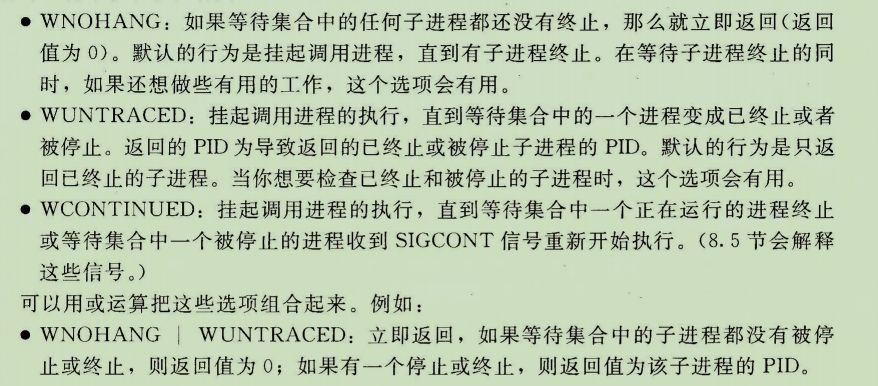
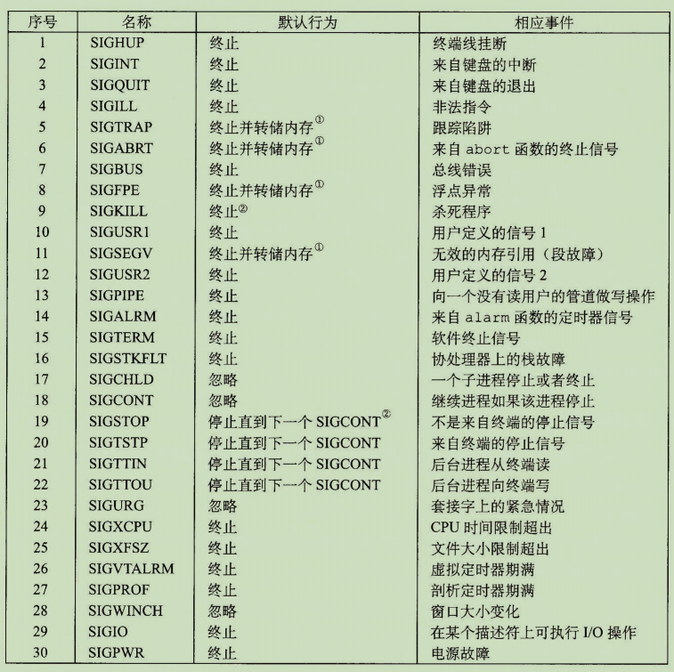

# Shell Lab

## 大纲

1. 书中列举到的重要函数及使用。
2. 中断、进程、进程组等基础知识。
3. 书中重要的代码示例和程序使用实例。
4. Linux信号表。

## 重要基础概念：

<mark style="color:blue;">**本部分较为简略，适合已经看过一遍书或者课程视频后速览使用。**</mark>

### 系统调用错误处理及错误包装函数：

Unix系统级函数（如_fork_()后文会提到)调用出错时，会返回-1，并设置_errno_来表示出错的内容。程序员应该总是检查错误，如下：

```
if ((pid = fork()) < 0) {
    fprintf(stderr, "fork error: %s\n", strerror(errno));
    exit(0);
}
```

但是这种错误检查会使代码变得臃肿，而且难以读懂。所以可将2、3行封装为_unix\_error_函数：

```
void unix_error (char *msg) {
    fprintf(stderr, "%s : %s\n", msg, strerror(errno));
    exit(0);
}
```

再进一步可得到错误包装函数_Fork_:

```
pid_t Fork(void) {
    pid_t pid;
    if ((pid = fork()) < 0) {
        unix_error("fork error");
    }
    return pid
}
```

给定这个包装函数，对_fork的调用就变为一行：_

```
pid = Fork();
```

后文基本使用错误包装函数。


### 进程和进程组

列举重要函数：

#### 获取进程ID:

```
#include <sys/types.h>
#include <unistd.h>

pid_t getpid(void) //获取当前进程pid
pid_t getppid(void) //获取父进程pid
```

#### 退出进程：

```
#include <stdlib.h>
void exit(int status) //以status状态退出进程
```

#### 创建子进程：

```
#include <sys/types.h>
#include <unistd.h>

pid_t fork(void);
```

使用此函数将创建一个子进程，父进程中返回值为子进程的pid，若创建失败返回-1。子进程中返回0，即使用一次，返回两次。

#### 回收进程：

```
#include <sys/types.h>
#include <sys/wait.h>

pid_t waitpid(pid_t pid, int *statusp, int options);
```

该函数调用后默认挂起当前进程，直到一个**等待集合**中的子进程终止，回收终止的子进程。

参数含义：

1. pid : 大于0表示等待集合由该pid指定的子进程组成，等于 -1 表示等待集合由所有的子进程组成。
2. statusp: 函数将导致子进程返回的原因信息放在该参数中，可通过WIFEXITED(status),WIFSIGNALED(status)等宏返回的值判断子进程返回的原因。
3. options: 可用于修改函数的默认行为（如下图）：



#### 进程休眠：

```
#include <unistd.h>
unsigned int sleep(unsigned int secs);//sces表示休眠时间，返回值为剩余休眠时间
```

```
#include <unistd.h>
int pause(void) //进程休眠直到收到一个信号
```

#### 加载并运行程序:

```
#include <unistd.h>
int execve(const char *filename, const char *argv[], 
                                const char*envp[])
```

形参分别表示_**可执行文件**_、_**参数列表**_、_**环境列表**_。

#### 获取进程组id:

```
#include <unistd.h>
pid_t getpgrp(void); //返回进程组id
```

#### 设置进程组id:

```
#include <unistd.h>
int setpgid(pid_t pid, pid_t pgid);
```

将指定pid的进程的进程组id设为pgid。如果pid为0，代表当前进程，如果pgid为0,代表用当前进程ID作为进程组ID。

### 信号：

#### 信号列表：



#### 向进程发送信号：

```
#include <sys/types.h>
#include <signal.h>

int kill(pid_t pid, int sig);//向进程pid发送信号sig
```

若pid大于0，则向pid代表的进程发送信号。若等于0，则向当前进程所在进程组的所有进程发送信号。若小于0，则向-pid代表的进程组中的每个进程发送信号。

```
#include <unistd.h>

unsigned int alarm(unsigned int secs)
```

在secs秒后发送一个SIGALRM信号给调用进程。返回值为剩余秒数。

### 实验基本框架：

源自书中524-526代码示例（8.4.6 利用fork和execve运行程序）

首先是简单shell 的例程。shell 打印一个命令行提示符，等待用户在stdin输入命令,再对命令求值。
