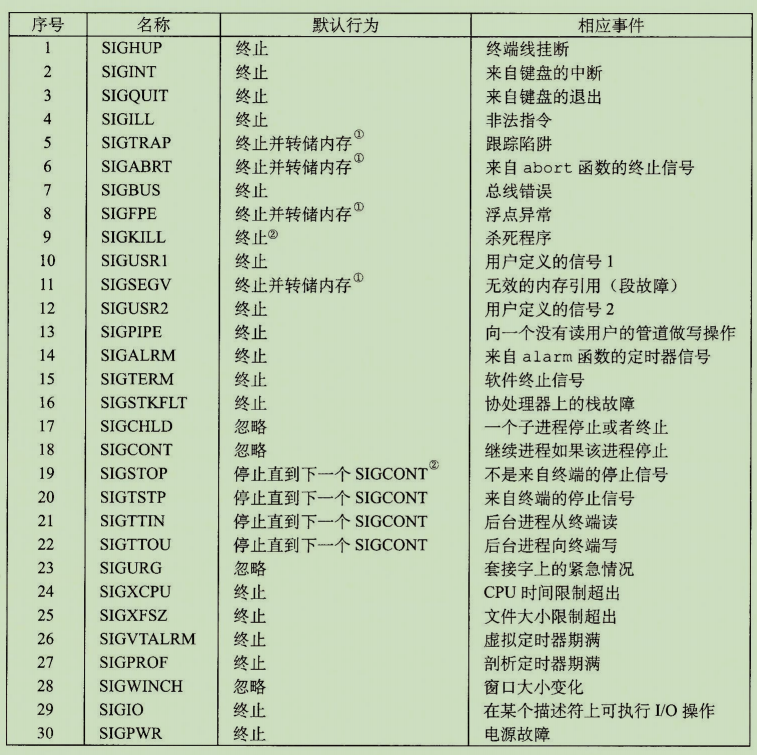

# Shell Lab

## 重要基础概念：

<mark style="color:blue;">**本部分较为简略，适合已经看过一遍书或者课程视频后速览使用。**</mark>

### 系统调用错误处理及错误包装函数：

Unix系统级函数（如_fork_()后文会提到)调用出错时，会返回-1，并设置_errno_来表示出错的内容。程序员应该总是检查错误，如下：

```
if ((pid = fork()) < 0) {
    fprintf(stderr, "fork error: %s\n", strerror(errno));
    exit(0);
}
```

但是这种错误检查会使代码变得臃肿，而且难以读懂。所以可将2、3行封装为_unix\_error_函数：

```
void unix_error (char *msg) {
    fprintf(stderr, "%s : %s\n", msg, strerror(errno));
    exit(0);
}
```

再进一步可得到错误包装函数_Fork_:

```
pid_t Fork(void) {
    pid_t pid;
    if ((pid = fork()) < 0) {
        unix_error("fork error");
    }
    return pid
}
```

给定这个包装函数，对_fork的调用就变为一行：_

```
pid = Fork();
```

后文基本使用错误包装函数。


### 进程和进程组

列举重要函数：

#### 获取进程ID:

```
#include <sys/types.h>
#include <unistd.h>

pid_t getpid(void) //获取当前进程pid
pid_t getppid(void) //获取父进程pid
```

#### 退出进程：

```
#include <stdlib.h>
void exit(int status) //以status状态退出进程
```

#### 创建子进程：

```
#include <sys/types.h>
#include <unistd.h>

pid_t fork(void);
```

使用此函数将创建一个子进程，父进程中返回值为子进程的pid，若创建失败返回-1。子进程中返回0，即使用一次，返回两次。

#### 回收进程：

```
#include <sys/types.h>
#include <sys/wait.h>

pid_t waitpid(pid_t pid, int *statusp, int options);
```

该函数调用后默认挂起当前进程，直到一个**等待集合**中的子进程终止，回收终止的子进程。

参数含义：

1. pid : 大于0表示等待集合由该pid指定的子进程组成，等于 -1 表示等待集合由所有的子进程组成。
2. statusp: 函数将导致子进程返回的原因信息放在该参数中，可通过WIFEXITED(status),WIFSIGNALED(status)等宏返回的值判断子进程返回的原因。
3. options: 可用于修改函数的默认行为（如下图）：


#### 进程休眠：

```
#include <unistd.h>
unsigned int sleep(unsigned int secs);//sces表示休眠时间，返回值为剩余休眠时间
```

```
#include <unistd.h>
int pause(void) //进程休眠直到收到一个信号
```

#### 加载并运行程序:

```
#include <unistd.h>
int execve(const char *filename, const char *argv[], 
                                const char*envp[])
```

形参分别表示_**可执行文件**_、_**参数列表**_、_**环境列表**_。

#### 获取进程组id:

```
#include <unistd.h>
pid_t getpgrp(void); //返回进程组id
```

#### 设置进程组id:

```
#include <unistd.h>
int setpgid(pid_t pid, pid_t pgid);
```

将指定pid的进程的进程组id设为pgid。如果pid为0，代表当前进程，如果pgid为0,代表用当前进程ID作为进程组ID。

### 信号：

#### 信号列表：



#### 向进程发送信号：

```
#include <sys/types.h>
#include <signal.h>

int kill(pid_t pid, int sig);//向进程pid发送信号sig
```

若pid大于0，则向pid代表的进程发送信号。若等于0，则向当前进程所在进程组的所有进程发送信号。若小于0，则向-pid代表的进程组中的每个进程发送信号。

```
#include <unistd.h>

unsigned int alarm(unsigned int secs)
```

在secs秒后发送一个SIGALRM信号给调用进程。返回值为剩余秒数。

#### 接受信号：

```
#include <signal.h>
typedef void (*sighandler_t)(int)
sighandler_t signal(int signum, sighandler_t sighandler);
```

依据sighandler的不同，_signal_函数可设置进程对_signum_信号的处理方式:

* _sighandler为SIG\_INT时，_表示忽略_signum_信号。
* _sighandler_为_SIG\_DFL_时，表示采用默认行为（默认行为见信号表）。
* _sighandler_为用户定义的函数地址时，表示采用用户定义的函数来处理信号。

#### 阻塞和接触阻塞信号

主要用到以下函数：

```
#include <signal.h>

int sigprocmask(int how, const sigset_t *set, const sigset_t *oldset);
int sigemptyset(sigset_t *set） //清空阻塞集合
int sigfillset(sigset_t *set)  /将所有信号加入阻塞集合
int sigaddset(sigset_t *set, int signum); //集合中加入signum
int sigdelset(sigset_t *set, int signum); //集合中删除signum
int sigismember(sigset_t *set, int signum);//判断signum是否为set成员，是则返回1
```

对于第一个函数，_how_表示不同的行为：

* _SIG\_BLOCK_:表示把set中的信号添加到阻塞信号中。
* _SIGUNBLOCK:_顾名思义，用法同_SIG\_BLOCK。_
* _SIG\_SETMASK:_把原来的阻塞信号集合替换为_set。_

_oldset_用于保存旧的阻塞信号集合_。_

_sigsuspend_函数：

```
#include <signal.h>
int sigsuspend(const sigset_t *mask);  
```

暂时用mask替换当前的信号阻塞集合，挂起进程直到收到信号，且其行为要么是运行一个终止程序要么是终止该进程。如果他的行为是终止，那么该进程不从该函数返回就直接终止。如果他的行为是运行一个处理程序，那么该函数从处理程序返回并恢复原有的阻塞信号集合。

## 实验

实验详细介绍可见WriteUp:[http://csapp.cs.cmu.edu/3e/shlab.pdf](http://csapp.cs.cmu.edu/3e/shlab.pdf)

以及CMU的PPT:[http://www.cs.cmu.edu/afs/cs/academic/class/15213-f15/www/recitations/rec09.pdf](http://www.cs.cmu.edu/afs/cs/academic/class/15213-f15/www/recitations/rec07.pdf)

### 实验要求：

实验目的是熟悉进程控制和信号发送与接受处理。我们需要完成一个名为tsh的shell程序，支持几个内建命令程序运行命令。规则如下：

* 内建命令包括：jobs,用于列举出所有正在运行的进程；exit退出程序。bg(g） %n(n),表示将%n(n)代表的进程转至后台（前台）运行。若使用%n表示jid为n,若使用n表示pid为n；
* "&":在命令末尾加入&表示在后台运行程序，若不加表示在前台运行程序。
* 以可执行文件目录开始，表示运行此可执行文件。之后可跟参数。如

```
>tsh ./myspin 3 &
```

更详细规则可见WriteUp及实验包中的trace.txt系列文件和tshref.out文件。

实验给出了程序的基本框架，并给出了一些辅助函数如下：

```
//命令行解析函数
int parseline(const char *cmdline, char **argv); 
//ctrl + c的信号处理
void sigquit_handler(int sig);
//清除job
void clearjob(struct job_t *job);
//初始化job列表
void initjobs(struct job_t *jobs);
int maxjid(struct job_t *jobs); 
//添加job
int addjob(struct job_t *jobs, pid_t pid, int state, char *cmdline);
删除job
int deletejob(struct job_t *jobs, pid_t pid); 
//得到前台job的pid
pid_t fgpid(struct job_t *jobs);
//通过pid得到job
struct job_t *getjobpid(struct job_t *jobs, pid_t pid);
//通过jid得到job
struct job_t *getjobjid(struct job_t *jobs, int jid); 
//pid转jid
int pid2jid(pid_t pid);
//打印所有job 
void listjobs(struct job_t *jobs);
pid_t Fork(void);
void usage(void);
void unix_error(char *msg);
void app_error(char *msg);
typedef void handler_t(int);
handler_t *Signal(int signum, handler_t *handler);
```

我们需要完成七个函数：

```
void eval(char *cmdline);//命令行估值
int builtin_cmd(char **argv);//内建命令
void do_bgfg(char **argv);//前台后台程序执行
void waitfg(pid_t pid);//等待前台进程结束
//信号处理。从信号表及函数名知对应需处理的信号
void sigchld_handler(int sig);
void sigtstp_handler(int sig);
void sigint_handler(int sig);
```


### 实验基本框架：

源自书中524-526代码示例及实验包中代码（8.4.6 利用fork和execve运行程序）

首先是shell 的例程。shell 打印一个命令行提示符，等待用户在stdin输入命令,再对命令求值。

```
int main(int argc, char **argv) 
{
    char c;
    char cmdline[MAXLINE];
    int emit_prompt = 1; /* emit prompt (default) */

    /* Redirect stderr to stdout (so that driver will get all output
     * on the pipe connected to stdout) */
    dup2(1, 2);

    /* Parse the command line */
    while ((c = getopt(argc, argv, "hvp")) != EOF) {
        switch (c) {
        case 'h':             /* print help message */
            usage();
	    break;
        case 'v':             /* emit additional diagnostic info */
            verbose = 1;
	    break;
        case 'p':             /* don't print a prompt */
            emit_prompt = 0;  /* handy for automatic testing */
	    break;
	default:
            usage();
	}
    }

    /* Install the signal handlers */

    /* These are the ones you will need to implement */
    Signal(SIGINT,  sigint_handler);   /* ctrl-c */
    Signal(SIGTSTP, sigtstp_handler);  /* ctrl-z */
    Signal(SIGCHLD, sigchld_handler);  /* Terminated or stopped child */

    /* This one provides a clean way to kill the shell */
    Signal(SIGQUIT, sigquit_handler); 

    /* Initialize the job list */
    initjobs(jobs);

    /* Execute the shell's read/eval loop */
    while (1) {

	/* Read command line */
	if (emit_prompt) {
	    printf("%s", prompt);
	    fflush(stdout);
	}
	if ((fgets(cmdline, MAXLINE, stdin) == NULL) && ferror(stdin))
	    app_error("fgets error");
	if (feof(stdin)) { /* End of file (ctrl-d) */
	    fflush(stdout);
	    exit(0);
	}

	/* Evaluate the command line */
	eval(cmdline);
	fflush(stdout);
	fflush(stdout);
    } 

    exit(0); /* control never reaches here */
}
```

_parseline_函数，对输入的命令解析，去掉空格符，存入_argv_中。返回值为1表示在后台运行，否则为前台运行。

```
int parseline(const char *cmdline, char **argv) 
{
    static char array[MAXLINE]; /* holds local copy of command line */
    char *buf = array;          /* ptr that traverses command line */
    char *delim;                /* points to first space delimiter */
    int argc;                   /* number of args */
    int bg;                     /* background job? */

    strcpy(buf, cmdline);
    buf[strlen(buf)-1] = ' ';  /* replace trailing '\n' with space */
    while (*buf && (*buf == ' ')) /* ignore leading spaces */
	buf++;

    /* Build the argv list */
    argc = 0;
    if (*buf == '\'') {
	buf++;
	delim = strchr(buf, '\'');
    }
    else {
	delim = strchr(buf, ' ');
    }

    while (delim) {
	argv[argc++] = buf;
	*delim = '\0';
	buf = delim + 1;
	while (*buf && (*buf == ' ')) /* ignore spaces */
	       buf++;

	if (*buf == '\'') {
	    buf++;
	    delim = strchr(buf, '\'');
	}
	else {
	    delim = strchr(buf, ' ');
	}
    }
    argv[argc] = NULL;
    
    if (argc == 0)  /* ignore blank line */
	return 1;

    /* should the job run in the background? */
    if ((bg = (*argv[argc-1] == '&')) != 0) {
	argv[--argc] = NULL;
    }
    return bg;
}
```

书中的_eval_函数、_builtin\_command_函数框架，实验可以此为参考：


### 正式实验

首先从已有的框架出发，可以获取实验思路。

在书中的eval函数中，首先调用parseline函数解析命令行。之后将解析后得到的命令行参数列表_argv_传入_builtin\_command_函数中，如果为内建命令，则执行相关操作并返回1.若不为内建命令，返回0。之后依据返回值，来确定是否再执行其他相关操作。

由此，我们首先可以发现_builtin\_command_函数对于内建命令的判断还不全，可以先完善这个函数如下：

```
int builtin_cmd(char **argv) 
{
    if (!strcmp(argv[0], "quit")) {
        exit(0);
    }
    if (!strcmp(argv[0], "bg") || !strcmp(argv[0], "fg")) {
        do_bgfg(argv);
        return 1;
    }
    if (!strcmp(argv[0], "jobs")) {
        listjobs(jobs);
        return 1;
    }
    if (!strcmp(argv[0], "&")) {
        return 1;
    }
    return 0;
}
```

自然，我们需要完成_do\_bgfg_函数，思路很简单，只需要判断命令传入的是bg还是fg，以及传入的是jid还是pid，判断之后看相应的进程是否存在，若存在将他将它转至对应的前台/后台就可以了（需要发送SIGCONT信号重启进程）。

```
void do_bgfg(char **argv) 
{
    struct job_t *job = NULL;
    int id;
    int state;
    if (argv[0] == NULL || argv[1] == NULL) {
        printf("%s command requires PID or %%jobid argument\n", argv[0]);
        return ;
    }
    if (strcmp(argv[0], "bg")) {    //判断是前台还是后台
        state = BG;
    }
    else {
        state = FG;
    }
    if (argv[1][0] == '%') {    //判断输入的是jid还是pid
        if (sscanf(&argv[1][1], "%d", &id) > 0) {
            job = getjobjid(jobs, id);
            if (job == NULL) {
                printf("No such process");
                return ;
            }
        }
    }
    else {
        if (!isdigit(atoi(argv[1]))) {
            printf("Error of pid id");
        }
        else {
            id = atoi(argv[1]);
            job = getjobpid(jobs, id);
            if (job == NULL) {
                printf("No such process");
                return ;
            }
        }
    }
    kill(-(job->pid), SIGCONT);
    job->state = state;    //进程的状态信息可能发生改变，需要将新的state赋值给它
    if (state == FG) {
        waitfg(job->pid); //转为等待前台结束状态
    }
    else {
        printf("[%d] (%d) %s",job->jid, job->pid, job->cmdline);
    }
}
```

紧接着，我们需要完善一下_waitfg_函数，最直观的方法如下：

```
void waitfg(pid_t pid)
{
    while(fgpid()) {
        pause();
    }
}
```

该方法检测前台pid是否为0(即shell程序),若不为0则执行_pause_函数，等待子进程发送信号之后，再回到进程。然而此方法存在竞争(race)问题，即若子进程在while循环判断之后、_pause_函数运行之前结束，那么pause将永久睡眠。

另一个选择是用_sleep_函数代替_pause函数。_

```
void waitfg(pid_t pid)
{
    while(fgpid()) {
        sleep(1);
    }
}
```

然而这种方式太慢。可以采用前文_sigsuspend函数_来完成_waitfg_函数：

```
void waitfg(pid_t pid)
{
    sigset_t mask;
    sigemptyset(&mask);
    while(fgpid()) {
        sigsuspend(&mask);
    }
}
```

更详细的介绍可以见书544 - 545对显式等待信号的讲解。

此时，我们可以来修改_eval函数。_eval函数的主要问题也是存在竞争，于书上541-543(8.5.6 同步流以避免讨厌的并发错误)有详细讲解。在创建子进程前，我们需要先阻塞SIG\_CHLD信号，待将子进程添加到jobs列表后，再接触阻塞。以避免子进程在添加到jobs列表中之前就结束，导致_deletejob_先于_addjob_执行而出现问题。

修改后如下

```
void eval(char *cmdline) 
{
    int bg;
    char buf[MAXLINE];//use for parseline
    char *argv[MAXARGS];
    int state;// bg or fg
    sigset_t mask_all, msak_one, prev_all;
    sigfillset(&mask_all);//block all
    sigemptyset(&msak_one);//block one
    sigaddset(&msak_one, SIGCHLD); //block SIGCHLD
    pid_t pid;
    strcpy(buf, cmdline);
    bg = parseline(buf, argv);
    state = bg ? BG : FG;
    if (!builtin_cmd(argv)) {
        sigprocmask(SIG_BLOCK, &msak_one, &prev_all); // 阻塞SIGCHLD信号，避免Race
        if ((pid = Fork()) == 0) {
            sigprocmask(SIG_SETMASK, &prev_all, NULL); // 子进程解除阻塞
            setpgid(0, 0);
            if (execv(argv[0], argv) == -1) {
                exit(0);
            }
        }
        if (state == FG) {
            sigprocmask(SIG_BLOCK, &mask_all, &prev_all);
            addjob(jobs, pid, state, cmdline);
            sigprocmask(SIG_SETMASK, &prev_all, NULL);//添加完毕后再解除阻塞
            waitfg(pid);
        }
        else {
            sigprocmask(SIG_BLOCK, &mask_all, &prev_all);
            addjob(jobs, pid, state, cmdline);
            printf("[%d] (%d) %s",pid2jid(pid), pid, cmdline);
            sigprocmask(SIG_SETMASK, &prev_all, NULL);
        }
    }
}
```

最后，我们只需要完成三个信号处理函数即可，难度不大，参考书中示范即可完成。注意点在于保护全局变量errno,同时注意信号不排队的特点（即收到一个信号处理时后来的信号会被直接丢弃），通过信号阻塞来保证处理到全部信号。详细内容可参考书上的8.5.5部分。

```
void sigchld_handler(int sig) 
{
    int olderrno = errno;
    int status;
    pid_t pid;
    struct job_t * job;
    sigset_t mask_all, prev;
    sigfillset(&mask_all);
    while ((pid = waitpid(-1, &status, WNOHANG|WUNTRACED)) != 0) {
        sigprocmask(SIG_BLOCK, &mask_all, &prev);//阻塞信号
        if (WIFEXITED(status)) {
            deletejob(jobs, pid);
        }
        else if (WIFSIGNALED(status)) {
            printf ("Job [%d] (%d) terminated by signal %d\n", pid2jid(pid), pid, WTERMSIG(status));
            deletejob(jobs, pid);
        }
        else if (WIFSTOPPED(status)) {
            printf ("Job [%d] (%d) stoped by signal %d\n", pid2jid(pid), pid, WSTOPSIG(status));
            job = getjobpid(jobs, pid);
            job->state = ST;
        }
        sigprocmask(SIG_SETMASK, &prev, NULL);//处理完毕后解除阻塞
    }
    errno = olderrno;
}
```

```
/* 
 * sigint_handler - The kernel sends a SIGINT to the shell whenver the
 *    user types ctrl-c at the keyboard.  Catch it and send it along
 *    to the foreground job.  
 */
void sigint_handler(int sig) 
{
    int olderrno = errno;
    pid_t pid;
    sigset_t mask_all, prev;
    sigfillset(&mask_all);
    if ((pid = fgpid(jobs)) != 0) {
        sigprocmask(SIG_BLOCK, &mask_all, &prev);
        kill(-pid, SIGINT);
        sigprocmask(SIG_SETMASK, &prev, NULL);
    }
    errno = olderrno;
}
//两个函数差不多
/*
 * sigtstp_handler - The kernel sends a SIGTSTP to the shell whenever
 *     the user types ctrl-z at the keyboard. Catch it and suspend the
 *     foreground job by sending it a SIGTSTP.  
 */
void sigtstp_handler(int sig) 
{
    int olderrno = errno;
    pid_t pid;
    sigset_t mask_all, prev;
    sigfillset(&mask_all);
    if ((pid = fgpid(jobs)) != 0) {
        sigprocmask(SIG_BLOCK, &mask_all, &prev);
        kill(-pid, SIGSTOP);
        sigprocmask(SIG_SETMASK, &prev, NULL);
    }
    errno = olderrno;
}
```
